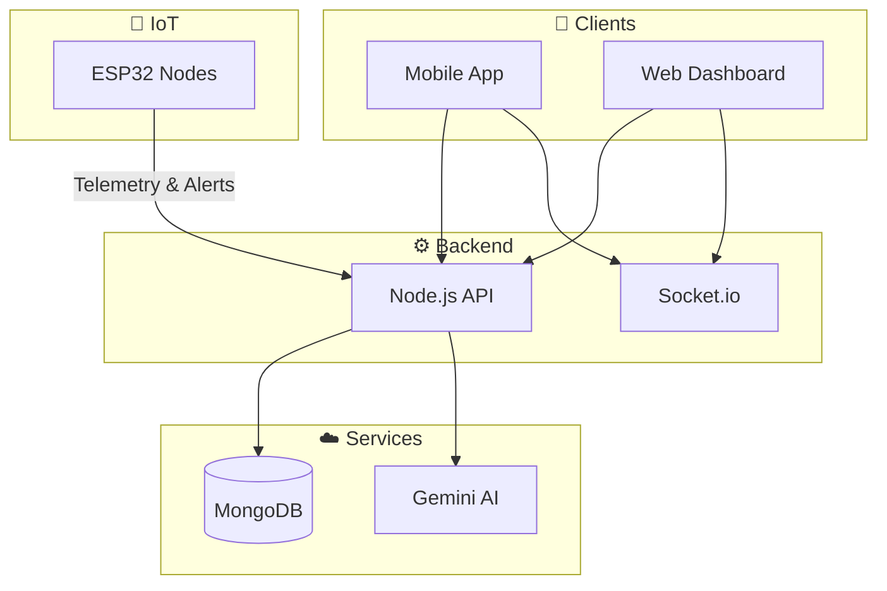

<div align="center">

# 🛡️ Kavach

### *One platform to prevent, detect, and respond.*

**AI-Powered Disaster Preparedness & School Safety Platform**

[](LICENSE)
[](https://nodejs.org/)
[](https://flutter.dev/)
[](https://www.mongodb.com/)
[](https://www.sih.gov.in/)

---

[Overview](#-overview) • [Features](#-features) • [Screenshots](#-screenshots--architecture) • [Tech Stack](#-tech-stack) • [Quick Start](#-quick-start) • [Docs](#-documentation)

</div>

---

## 📑 Table of Contents

| Section | Description |
| :--- | :--- |
| [Overview](#-overview) | Problem, solution, and why Kavach |
| [Features](#-features) | IoT, AI, Mobile, Web in detail |
| [Screenshots & Architecture](#-screenshots--architecture) | Preview images and system diagram |
| [Tech Stack](#-tech-stack) | Technologies used |
| [Quick Start](#-quick-start) | Install, configure, run in minutes |
| [IoT Setup](#-iot-setup-esp32) | ESP32 and sensor integration |
| [Documentation](#-documentation) | Full docs and guides |

---

## 📌 Overview

> **The gap:** Schools lack an integrated system that combines **real-time physical sensors**, **AI-driven education**, and **drill management** in one place. Most solutions offer either hardware *or* software—not both.

**Kavach** unifies all three: **IoT sensors** for live hazard detection, **AI (Google Gemini)** for safety content and smart tools, and **drill & alert management** for the whole institution—so students, teachers, admins, and parents stay in one ecosystem.

| 🎯 **Problem** | ✅ **What Kavach does** |
|----------------|-------------------------|
| Scattered tools (alarms, papers, apps) | Single platform: web + mobile + IoT |
| No real-time sensor data in one place | ESP32 nodes → backend → live dashboards & alerts |
| Manual drill logs and reports | AI summaries, certificates, report cards |
| Generic safety info | Ask Kavach chatbot + daily tips + scenario game (voice-friendly) |
| Slow crisis communication | AI-drafted alerts & parent messages; broadcast + FCM push |

Built for **Smart India Hackathon**, aligned with **NDMA/NDRF** and school safety guidelines.

---

## 🖼️ Hero Preview

<!-- Replace with your image: docs/images/readme-hero.png -->
<p align="center">
  
</p>
<p align="center"><sub>📷 Add your hero image at <code>docs/images/readme-hero.png</code> (e.g. web dashboard + mobile home)</sub></p>

---

## ✨ Features

### 🔌 IoT & Real-Time

| Feature | Description |
| :--- | :--- |
| **Multi-sensor nodes** | ESP32 + flame sensor, water level, MPU6050 (fire, flood, earthquake) |
| **Telemetry & alerts** | Readings sent to backend; threshold breach → instant alerts + Socket.io broadcast |
| **Device management** | Register by institution/room, device token auth, health monitoring |

### 🤖 AI (Google Gemini)

| Category | What it does |
| :--- | :--- |
| **Vision** | Hazard detection, evacuation route check, floor plan analysis, damage scan, image description (accessibility) |
| **Text** | Today’s tip, **Ask Kavach** Q&A, disaster scenario game, quiz generation, drill/incident summaries, alert & crisis message drafting, school report card |
| **Voice (on-device)** | Speak to Ask Kavach (STT) and hear replies (TTS) in the mobile app |

<details>
<summary>📋 Expand: Full list of AI features (15+ endpoints)</summary>

- **Vision:** Hazard analyze, evacuation check, floor plan analyze, damage scan, describe image  
- **Text:** Today’s tip, Ask Kavach, scenario/next (game), quiz generate, drill summarise, incident/guideline summarise, alert draft, crisis parent message, drill feedback, recommend next module, suggest quiz difficulty, translate, simplify, report card  

</details>

### 📱 Mobile (Flutter)

- Learning modules, quizzes, certificates, preparedness score  
- **Ask Kavach** (text + voice), today’s tip, disaster scenario game  
- Drill participation, FCM push, offline-friendly design  

### 🌐 Web (Next.js)

- Admin/teacher dashboards: devices, drills, incidents, broadcast, reports  
- AI tools: hazard upload, evacuation/floor plan check, summariser, alert/crisis draft  
- Real-time updates via Socket.io  

---

## 📸 Screenshots & Architecture

| | **Mobile – Home** | **Mobile – Ask Kavach** |
| :---: | :---: | :---: |
| |  |  |
| *Add `docs/images/screenshot-mobile-home.png`* | *Add `docs/images/screenshot-ask-kavach.png`* |

| | **Web – Dashboard** | **IoT Node (ESP32)** |
| :---: | :---: | :---: |
| |  |  |
| *Add `docs/images/screenshot-web-dashboard.png`* | *Add `docs/images/screenshot-iot-node.png` (optional)* |

### 🏗️ System Architecture

<!-- Add your diagram at docs/images/architecture.png -->
<p align="center">
  
</p>
<p align="center"><sub>📷 Add your diagram at <code>docs/images/architecture.png</code></sub></p>

<details>
<summary>🔀 View Mermaid diagram (renders on GitHub)</summary>



</details>

---

## 🛠️ Tech Stack

| Layer | Technologies |
| :--- | :--- |
| **Backend** | Node.js, Express, MongoDB, Socket.io, JWT, Firebase Admin (FCM) |
| **AI** | Google Gemini API (vision + text) |
| **Web** | Next.js, React, Tailwind CSS |
| **Mobile** | Flutter, Dart, Riverpod, FCM, Socket.io client |
| **IoT** | ESP32 (Arduino C++), ArduinoJson, HTTPClient, MPU6050, flame & water sensors |

---

## 📁 Project Structure

```
├── backend/          # Node.js API (auth, devices, drills, alerts, AI)
├── web/              # Next.js admin/teacher dashboard
├── mobile/           # Flutter app (students, teachers)
├── arduino/          # ESP32 firmware + device guides
├── docs/             # Documentation
│   ├── project/      # RUN guide, AI/IoT, judging criteria
│   └── images/       # README screenshots & diagrams
├── scripts/          # Utility scripts (PowerShell)
├── package.json      # Root workspace (backend + web)
└── README.md
```

---

## 🚀 Quick Start

### Prerequisites

| Requirement | Version / Note |
| :--- | :--- |
| Node.js | 20+ |
| MongoDB | Local or Atlas |
| Flutter | For mobile (optional) |
| Gemini API key | Optional; for AI features |

### 1️⃣ Clone & install

```bash
git clone https://github.com/YOUR_USERNAME/kavach.git
cd kavach
npm run install:all
```

### 2️⃣ Environment

| App | Config |
| :--- | :--- |
| **Backend** | Copy `backend/env.example` → `backend/.env`. Set `MONGODB_URI`, `JWT_SECRET`, optional `GEMINI_API_KEY`. |
| **Web** | Copy `web/.env.example` → `web/.env.local`. Set `NEXT_PUBLIC_API_URL` (e.g. `http://localhost:3000`). |
| **Mobile** | Set base URL in `mobile/lib/core/config/env.dart` (see [RUN guide](docs/project/RUN.md)). |

### 3️⃣ Run

| App | Command | URL |
| :--- | :--- | :--- |
| **Backend** | `npm run dev:backend` | http://localhost:3000 |
| **Web** | `npm run dev:web` | http://localhost:3001 |
| **Mobile** | `cd mobile && flutter pub get && flutter run` | Device/emulator |

> 📖 **Full run guide (ports, FCM, IoT):** [docs/project/RUN.md](docs/project/RUN.md)

---

## 📡 IoT Setup (ESP32)

| Step | Action |
| :--- | :--- |
| **Firmware** | `arduino/esp_code_enhanced.ino` |
| **Config** | Wi-Fi SSID/password, backend URL, device ID, institution ID, room |
| **Token** | Register device via backend script or admin dashboard → set token in firmware |

📄 **Guides:** [Device Registration](arduino/DEVICE_REGISTRATION_GUIDE.md) · [Connection & API](docs/project/IOT_CONNECTION_AND_FINAL_CODE.md)

---

## 📚 Documentation

| Document | Description |
| :--- | :--- |
| [**RUN.md**](docs/project/RUN.md) | How to run backend, web, mobile |
| [**Docs index**](docs/README.md) | Phases, shared docs |
| [**IoT connection**](docs/project/IOT_CONNECTION_AND_FINAL_CODE.md) | Endpoints & code locations |
| [**AI features**](docs/AI_FEATURES_AND_TECHNOLOGY.md) | Vision, text, voice |
| [**Judging criteria**](docs/JUDGING_EVALUATION_CRITERIA.md) | Project evaluation summary |

---

## 🤝 Contributing

Contributions are welcome. Open an issue or submit a PR; for larger changes, discuss in an issue first.

---

## 📄 License

This project is licensed under the **MIT License** — see [LICENSE](LICENSE) for details.

---

## 🙏 Acknowledgments

- **Smart India Hackathon** – Problem statement and platform  
- **NDMA / NDRF** – School safety and disaster preparedness guidelines  
- **Google Gemini** – AI APIs for vision and text  
- *Your team, mentors, or institution*

---

<div align="center">

**🛡️ Kavach** — *Prevent · Detect · Respond*

</div>
